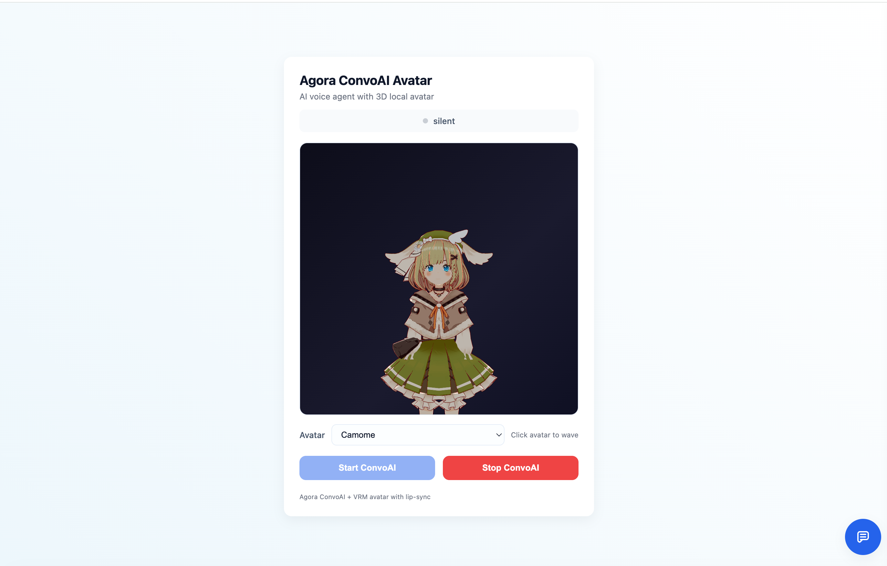

# Agora ConvoAI — Local Avatar Demo

A voice AI agent with a real-time animated 3D avatar. The AI agent runs via [Agora ConvoAI](https://docs.agora.io/en/conversational-ai/overview/product-overview), while the avatar renders locally in the browser using Three.js and VRM models with audio-driven lip-sync.



## How it works

- The browser joins an Agora RTC channel and publishes microphone audio
- The backend spins up a ConvoAI agent (via Agora REST API) that joins the same channel
- The agent's speech audio is tapped by a Web Audio `AnalyserNode` (FFT) to drive lip-sync on a local VRM avatar — Agora still handles actual audio playback
- Agent state changes (`speaking` / `listening` / `thinking`) arrive via RTM and animate the avatar's head, body pose, and expressions in real time
- Full text chat is available alongside voice via the RTM data channel

## Prerequisites

| Service | What you need |
|---|---|
| [Agora Console](https://console.agora.io) | App ID, App Certificate, API Key + Secret (from Developer Toolkit → RESTful API) |
| OpenAI-compatible LLM | Any endpoint that accepts `POST /chat/completions` (OpenAI, Azure OpenAI, etc.) |
| [MiniMax TTS](https://www.minimaxi.com) | API Key, Group ID, and a Voice ID |
| Node.js 18+ | — |

## Setup

**1. Clone and install**
```bash
git clone <repo-url>
cd Agora_ConvoAI_LocalAvatars
npm install --legacy-peer-deps
```

**2. Configure environment**
```bash
cp .env.example .env   # or copy the template below
```

Edit `.env`:
```env
# Agora — https://console.agora.io
AGORA_APP_ID=
AGORA_APP_CERTIFICATE=
AGORA_API_KEY=          # Developer Toolkit → RESTful API → Customer ID
AGORA_API_SECRET=       # Developer Toolkit → RESTful API → Customer Secret

# LLM (any OpenAI-compatible endpoint)
LLM_URL=https://api.openai.com/v1/chat/completions
LLM_API_KEY=
LLM_MODEL=gpt-4o-mini
LLM_SYSTEM_PROMPT=You are a helpful assistant. Keep answers short. Plain text only, no markdown.

# TTS — MiniMax
TTS_MINIMAX_API_KEY=
TTS_MINIMAX_GROUP_ID=
TTS_MINIMAX_VOICE_ID=English_PlayfulGirl

# Optional auth (leave blank to disable)
AUTH_USERNAME=
AUTH_PASSWORD=
```

**3. Run**
```bash
npm run dev       # development (auto-restart)
npm start         # production
```

Open `http://localhost:3000` and click **Start ConvoAI**.

## Adding your own avatar

1. Drop a `.vrm` file into `assets/avatars/`
2. Add an entry to `CONFIG.AVAILABLE_AVATARS` in `frontend/utils/config.js`:
   ```js
   { name: 'My Avatar', file: '/assets/avatars/MyAvatar.vrm' }
   ```

The dropdown populates automatically from that array. You can also switch avatars at runtime mid-conversation.

## Project structure

```
backend/
  server.js                   Express server
  controllers/agoraController.js  Token generation + ConvoAI REST API calls
frontend/
  app.js                      Main app logic (RTC, RTM, avatar wiring) — IIFE
  utils/config.js             CONFIG (VRM models, CDN URLs), API helpers
  utils/vrmAvatarManager.js   Three.js + VRM rendering + lip-sync engine
  utils/chat.js               Chat panel (RTM transcription display)
assets/avatars/               VRM model files served at /assets/*
```

## Customization

| What | Where |
|---|---|
| AI personality / system prompt | `LLM_SYSTEM_PROMPT` in `.env` |
| Agent greeting message | `greeting_message` in `backend/controllers/agoraController.js` |
| ASR language | `asr.language` in `agoraController.js` (default `en-US`) |
| TTS voice | `TTS_MINIMAX_VOICE_ID` in `.env` |
| Default avatar | `CONFIG.VRM_MODEL_URL` in `frontend/utils/config.js` |
| Avatar poses | `POSE_LIBRARY` at the top of `frontend/utils/vrmAvatarManager.js` |
| Silence timeout (agent re-engages after N ms of silence) | `silence_config.timeout_ms` in `agoraController.js` |
